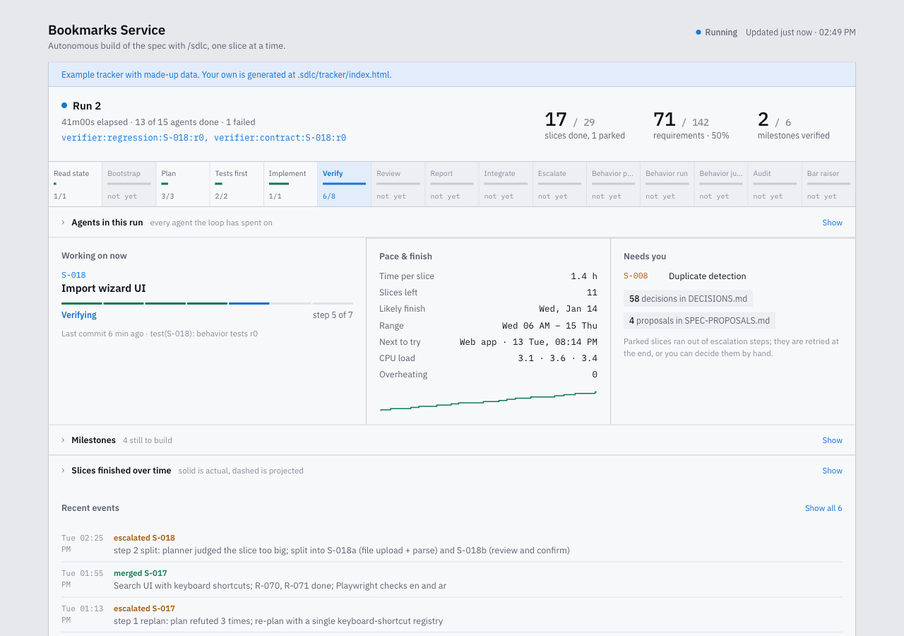
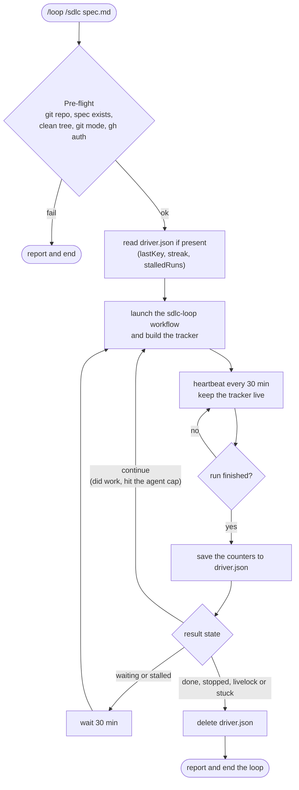
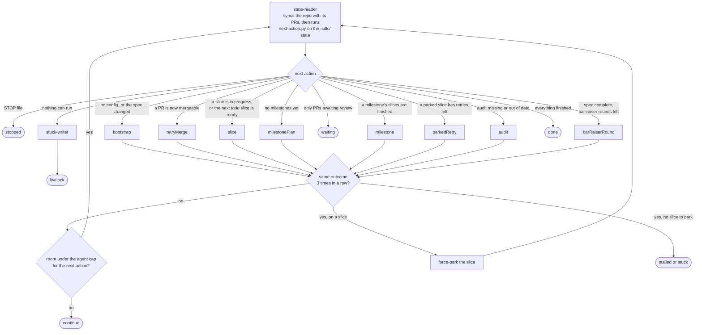
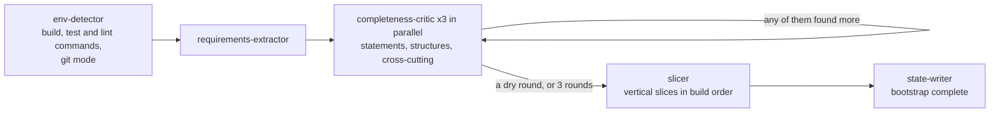
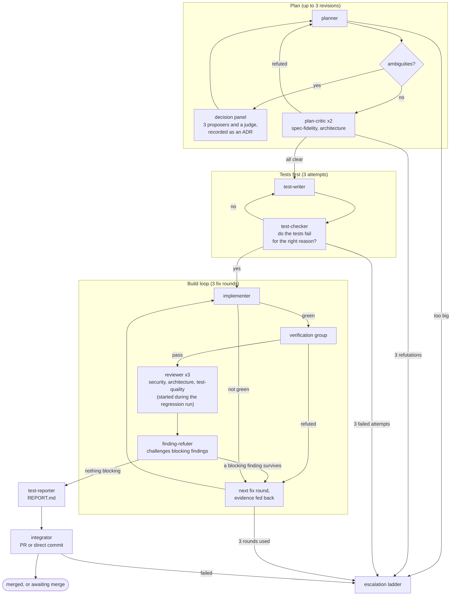
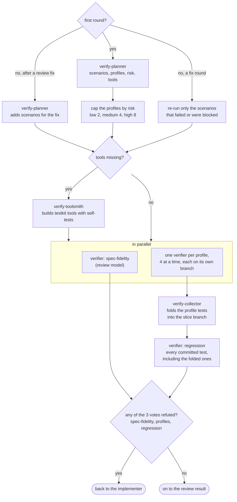
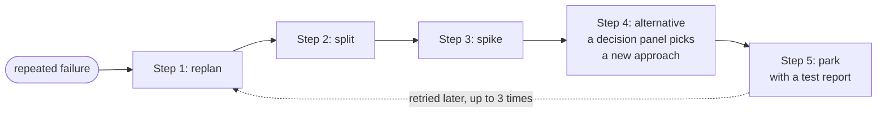
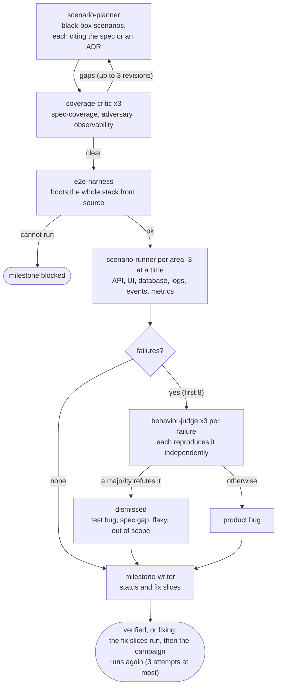
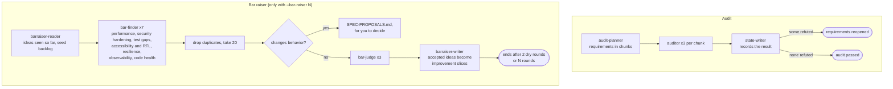

# sdlc — autonomous spec-to-product loop for Claude Code

`/sdlc` takes an approved spec and implements it end to end, without stopping to ask questions. It splits the spec into requirements and small vertical slices, and then runs each slice through an adversarial loop:

```
plan → tests first → implement → verify → review → integrate
                 └── on repeated failure: replan → split → spike → alternative → park

every milestone: plan scenarios → critique coverage → boot the real stack → run scenarios → judge failures → fix slices
```

Each slice is verified at its real boundary by a **verification group**:
- A **verify-planner** breaks the slice into test scenarios and tags each with every **profile** that can prove it wrong.
- A **verify-toolsmith** builds any verification tool the profiles need that the repo does not have yet. The tools go into the repo's testkit, each with its own self-test, and later slices reuse them.
- One **profile verifier** per profile tests its scenarios, alongside the spec-fidelity verifier. The regression verifier runs the full suite afterwards, on the branch that now holds the profile tests.

| Profile | Verifies | Against |
|---|---|---|
| `http-api` | endpoints, errors, persisted state | the real server and database |
| `async` | retries, backoff, outbox, leases | the worker loop on a fake clock |
| `concurrency` | uniqueness, idempotency, ordering | forced interleavings and the race detector |
| `data` | migrations, constraints, stored formats | the real database engine |
| `ui` | screens and interaction | Playwright and Chromium, with screenshots and axe |
| `i18n` | locales, fallback, RTL, bidi | UI and API in each locale |
| `cli` | commands, flags, exit codes, files | the built binary in a scratch project |
| `contract` | exported functions and types | the public entry point, with property and type tests |
| `security` | auth, tokens, tenancy, egress | an exploratory attack session |
| `limits` | stated sizes, timeouts, budgets, UI performance | measured at and past the spec's number (Chrome DevTools MCP when available) |

Verification scales with the slice:
- The planner rates each slice's risk, and the rating caps the group: low risk runs 2 profiles, medium 4, and high up to 8. Each profile agent works to a time limit.
- The full group runs once, in the slice's first round. Fix rounds re-run only the scenarios that failed or were blocked, and the regression lens re-runs every committed test.
- When a review finding sends the slice back for a fix, the planner adds scenarios for what the fix changed, and the profile verifiers test those.
- Profile agents run 4 at a time, because each one starts its own database and test runs.
- Every agent runs on the session model, the one the run is already using, so no particular model is required. You can have the spec-fidelity verifier and the three code reviewers run on a different model than the one that plans and writes the code, so one model's blind spots are not graded by the same model: pass `reviewModel` in the workflow args (one model name, or a list tried in order). The agents that challenge review findings stay on the session model, so each blocking finding is then checked by both. A review model that fails falls back to the next in the list and finally to the session model, and one that fails twice in a row is not tried again in that run. A review model that hangs instead of failing cannot be detected, which is why this is off by default.

Everything is scoped to what the spec says. Anything the spec leaves undefined is noted for later instead of blocking the slice.

When a milestone's slices are done, a **behavior campaign** checks what the running system actually does:
- It plans black-box scenarios from the spec, and every expected outcome cites the spec or an ADR. Critics then hunt for missing corner cases: authz, limits, races, retries, dependency failures and RTL.
- It boots the whole stack from source, then runners drive it through the API and Playwright. They check the response, the database, the logs, emitted events and metrics.
- Three independent judges reproduce every failure before it becomes a fix slice.
- The scenarios stay in the repo as an e2e suite that every later slice must keep green.

When every slice is done, a final audit checks the whole spec. Optional **bar-raiser** rounds then polish quality past what the spec asks for.

All progress lives in `.sdlc/` in your repo, so a run can be stopped, run into usage limits, or crash, and pick up where it left off.

## Install

In Claude Code:

```
/plugin marketplace add omarahr/sdlc
/plugin install sdlc@sdlc
```

Restart Claude Code if `/sdlc` doesn't show up right away.

To update later:

```
/plugin marketplace update sdlc
```

### Requirements

- A Claude Code version that has the **Workflow** tool (multi-agent workflows). The plugin launches the `sdlc-loop` workflow through it.
- `git`. For PR mode, the [GitHub CLI](https://cli.github.com) signed in with `gh auth login`. For MR mode on GitLab, the [GitLab CLI](https://gitlab.com/gitlab-org/cli) signed in with `glab auth login`.
- Python 3, which the loop uses to decide each next step, to write its state and to build the tracker.
- Whatever toolchain your spec needs (Node, Go, Docker, …). The loop detects the build, test and lint commands on its own.

## Write the spec first (recommended: Superpowers)

`/sdlc` works best on a spec written with the **brainstorming** skill from [obra's Superpowers plugin](https://github.com/obra/superpowers). That skill turns an idea into an approved design through a short Q&A. The design it writes has what the loop relies on:
- clear intent and non-goals;
- the architecture and units;
- exact error behavior and limits;
- a testing strategy;
- a build order.

The slicer follows the build order. The behavior campaigns take their expected outcomes and corner cases from the error-handling and limits sections. The fewer gaps the spec leaves, the fewer decisions the loop has to make on its own.

1. Install Superpowers: `/plugin install superpowers@claude-plugins-official`.
2. Describe what you want to build and let the brainstorming skill lead. Review the spec it writes to `docs/superpowers/specs/YYYY-MM-DD-<topic>-design.md` before you approve it.
3. Hand the approved spec to the loop (below).

Any clear Markdown spec works, but a vague one leaves many autonomous decisions to the loop, so skim `DECISIONS.md`.

## Usage

Run it from inside a git repo with a clean working tree:

```
/loop /sdlc docs/superpowers/specs/2026-01-15-my-app-design.md
```

Wrapping it in `/loop` is recommended. Each workflow run has a cap on how many agents it can use (850 by default), and the loop relaunches the run whenever it hits that cap or a usage limit. It checks back every 30 minutes until the spec is done. If 24 runs in a row make no progress (about 12 hours), the loop stops and reports why; run `/sdlc <spec>` to start it again.

| Command | What it does |
|---|---|
| `/sdlc <spec> [--git pr\|direct\|mr] [--commit-format "<format>"] [--max-iterations N] [--bar-raiser N]` | Start or resume a run |
| `/sdlc status` | Print the dashboard (`.sdlc/STATUS.md`) |
| `/sdlc stop` | Finish the current step, then exit. Run `/sdlc <spec>` to resume |

- `--git pr` (default when the repo has a GitHub remote): one branch and one PR per slice. It merges only once CI passes.
- `--git mr` (default when the remote is a GitLab that `glab` is signed in to): commits every slice to the branch you started on, pushes it, and keeps **one** merge request for the whole run open against the remote's default branch. After each slice it waits for the pipeline and fixes CI-only failures. When the run is done it marks the merge request ready; you review and merge it. Start from a feature branch. It also works on GitHub, as one pull request for the run.
- `--git direct`: commits to the branch you are on and pushes nothing. This is the default when there is no GitHub remote and no signed-in GitLab.
- `--commit-format "<format>"`: the subject of every commit and the merge-request title, with the placeholders `{type}`, `{id}` and `{subject}`. For example `"{type}: [PROJ-123] {subject}"`. Without it, the run uses a format only when the repo enforces one (a GitLab push rule, commitlint or a commit-msg hook).
- `--bar-raiser N`: allow up to N polish rounds after the spec is complete. The default is 0.
- `--max-iterations N`: a smoke run that stops after N iterations.

In every mode, when a slice ships the integrator deletes the branches of its earlier failed attempts (`sdlc/<id>-attempt-<n>`, locally and on the remote), and those of the slice it was split from once all of that slice's parts are done. The write-ups stay in `.sdlc/slices/<id>/`.

Live progress shows in `/workflows`.

## Track progress in the browser

`/sdlc` serves a progress tracker on `http://localhost:8787` and prints the url. Open it and leave it open. While a run is active, the workflow view updates live: the plugin's hook nudges the tracker each time an agent starts or finishes, and the card redraws within a few seconds without reloading the page (within about 7 s if the hook does not fire). The hook fires for the loop's workflow agents, so the card follows each agent within a couple of seconds. The rest of the page is rebuilt and reloaded every minute. `/sdlc tracker` rebuilds it on demand. One screen answers the three questions that matter:

- **is it working** — the run's elapsed time, the agents going right now, and a rail of all fifteen phases sized by the agent time spent in each. The phase running pulses; phases not yet reached are greyed;
- **how far along** — slices and requirements done, milestones verified, and a sparkline of the pace;
- **does it need me** — parked slices, autonomous decisions and spec proposals.

Under those, folded away until you want them: every agent in the run with its status, model, tokens and time (failed agents and the loop's earlier runs are there too), the milestones with their behavior-campaign status (to verify, fixing, verified) and ETAs, the full pace chart with its projection, and recent events. CPU load and overheating on macOS sit with the pace figures.

The workflow view is read from Claude Code's own run files, whose format is not documented, so it is left out if they cannot be read.



See the [live example page](https://htmlpreview.github.io/?https://github.com/omarahr/sdlc/blob/main/docs/example-tracker.html) (made-up data, source in [`docs/example-tracker.html`](docs/example-tracker.html)).

To serve it outside Claude Code, from a clone of this repo:
```
python3 skills/sdlc/tracker/collect.py --repo /path/to/your/project --serve
```

It binds `127.0.0.1` only. Pass `--host 0.0.0.0` to reach it from another machine on your network; the page carries this repo's spec and decisions, so do that only when you mean it. If 8787 is busy it takes the next free port and writes the url it used to `.sdlc/tracker/url`. Drop `--serve` to build the file without serving it.
It also has a **Test reports** section linking to `.sdlc/tracker/reports/`, with one page per slice. When a slice merges (or is parked), a **test-reporter** writes its test completion report, `.sdlc/slices/<id>/REPORT.md`. It contains:
- a summary;
- traceability from each spec line to the cases that prove it;
- every scenario and case, in Given / When / Then form, with its evidence (HTTP exchanges, database diffs, attempt timelines, screenshots, transcripts, property runs);
- the security sessions;
- the defects found along the way and how each was fixed;
- what was not tested.

On the HTML pages, every test a report names has its source shown under it, and each verification round follows as an appendix. The Markdown files are committed with the rest of `.sdlc/`, so they can also be read on GitHub.

The collector needs Python 3 and nothing else. To share the page, send someone the url while the run is going, or the `.sdlc/tracker/index.html` file afterwards.

## What it writes to your repo

| File | Contents |
|---|---|
| `.sdlc/tracker/index.html` | The browser tracker (generated, gitignored) |
| `.sdlc/slices/<id>/REPORT.md` | The slice's test completion report, for you to read |
| `.sdlc/slices/<id>/verification/` | Each round's scenario plan and the profile verifiers' cases, evidence, logs and screenshots |
| `.sdlc/testkit.json` | The verification tools in the repo's testkit, and how to use them |
| `.sdlc/STATUS.md` | Dashboard: requirements and slices done, the current slice, recent events |
| `.sdlc/requirements.json`, `.sdlc/slices.json` | The spec broken into requirements and slices |
| `.sdlc/DECISIONS.md` | Every autonomous decision it made. **Skim this** |
| `.sdlc/SPEC-PROPOSALS.md` | Product ideas it found and left for you to decide |
| `.sdlc/milestones.json`, `.sdlc/milestones/<id>/` | Milestones and their behavior campaigns: scenarios, runs with raw evidence, judge verdicts and a report |
| `e2e/`, `e2e/pending.json` | The black-box e2e suite the campaigns build, and the scenarios waiting on a fix slice |
| `.sdlc/STUCK.md` | Written only if it livelocks. Contains the smallest human decision that would unblock it |
| `.sdlc/slices/<id>/` | Per-slice plans, reviews and verification reports |

## Before you run it

- **It is expensive.** Every slice goes through planning, test writing, implementation, integration-level behavior tests, review and verification, plus a black-box behavior campaign per milestone. As a rough guide, one real project averaged about 70 agents and about 4–5M subagent tokens per finished slice. Use it for well-specified projects on a plan with high limits.
- **It is heavy on your machine.** It runs builds, test suites, containers and browsers for hours. Behavior campaigns run at most three scenario runners at a time. On laptops, keep the machine plugged in and ventilated, and keep an eye on heat.
- **It only knows what the spec says.** Gaps in the spec are filled with autonomous decisions, and every one is logged in `DECISIONS.md`.
- **It never overwrites your uncommitted work.** It refuses to start on a dirty working tree.

## How it works

These diagrams follow `skills/sdlc/sdlc-loop.js` and `skills/sdlc/SKILL.md`. Every box is an agent role from `prompts/` or a function in the script.

### The driver: `/sdlc` relaunches the workflow until it ends



- `waiting`: only PRs awaiting human review remain.
- `stalled`: the run completed nothing, or it repeated the same outcome three times.
- `stuck`: 24 stalled runs in a row, about 12 hours without progress.
- `livelock`: nothing can run without a human decision. `.sdlc/STUCK.md` names the smallest one.

### One run: read the state, pick one action, repeat



The workflow script cannot read files, so it never chooses the next step itself. Each iteration the state-reader agent runs `next-action.py`, a small script that reads the `.sdlc/` state and checks, in order: stop or bootstrap, work in flight, milestones, new work, nothing can start, wrap up. The workflow runs that one action and asks again. State the script cannot explain ends the run as stalled instead of guessing.

### Bootstrap: the spec becomes requirements and slices



The three critics add requirements through `state-write.py`, which takes a lock, assigns the ids and refuses a quote that is already in the ledger, so they can work at the same time.

### A slice: plan, tests first, build loop, integrate



Progress is saved after each phase, so a resumed slice picks up where it stopped. Review findings that do not block, and verifier ideas outside the spec, are kept as seeds for the bar raiser.

### The verification group



**The full suite runs twice per round, not four times.** The implementer runs it to get green, and the regression verifier runs it on the branch that holds the profile tests. The regression verifier then writes a receipt (`suite-receipt.py`) for the exact code it tested, where state commits under `.sdlc/` do not count as a change:
- the integrator's final check reuses the receipt and only runs the suite itself when the code differs;
- the next slice's test-time budget uses the receipt's wall time as its baseline, so the suite is not run on the default branch just to time it.

When the spec-fidelity and profile verifiers all held, the three reviewers start together with the regression verifier instead of after it: they only read code, and by then the branch holds the profile tests. If the regression run then fails, any blocking review finding goes back to the implementer in the same fix round.

### The escalation ladder



Each failure climbs one rung. A parked slice never blocks the slices that depend on it. An improvement slice from the bar raiser is reverted and rejected at the last rung instead of parked.

### A milestone's behavior campaign



### The final audit and the bar raiser



## Development

The workflow script and prompts live in `skills/sdlc/`:

```
skills/sdlc/
  SKILL.md        # the /sdlc command
  tracker/        # collect.py, workflow.py + template.html: the browser tracker
  sdlc-loop.js    # the workflow (orchestration)
  next-action.py  # decides the next action from the .sdlc/ state
  state-write.py  # applies state changes: slice patches, STATUS.md, ledger additions
  suite-receipt.py  # records full test-suite runs, so the same code is not tested twice
  prompts/        # one prompt per role: planner, test-writer, implementer, verifier, reviewer, …
  test/           # tests for the workflow logic (node:test)
  fixtures/       # tiny specs for end-to-end checks
```

Run the tests with `npm test` (Node 20+ and Python 3). CI runs the same suite on Linux and macOS, on Node 20 and 24.

## License

MIT
